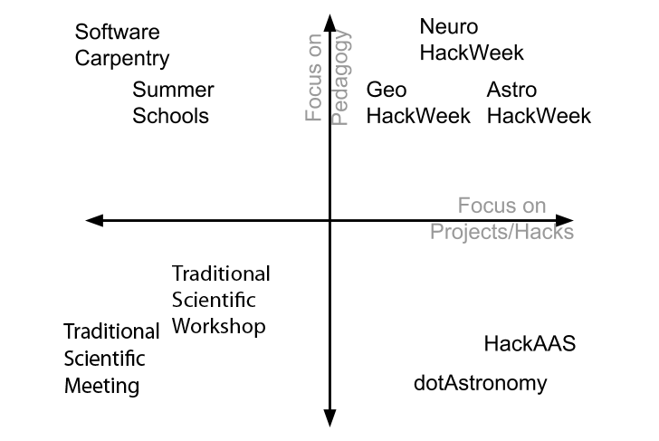
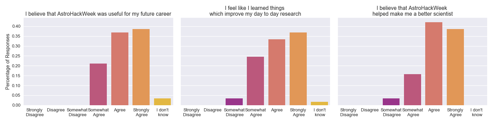
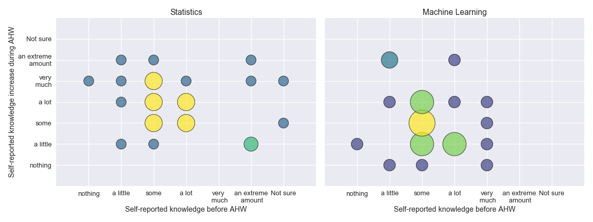
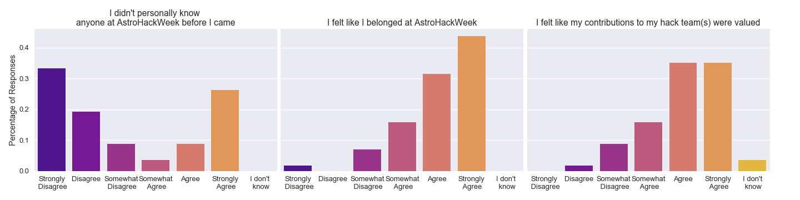

# How and Why to run a Hack Week

*This document is licensed under a CC-BY-ND License. See the file `LICENSE` for more details.*

## Authors

*Please add your name...*

- **Jake VanderPlas** *(UW)*

- **Karthik Ram** *(Berkeley)*

- **Daniela Huppenkothen** *(NYU)*

- **David W. Hogg** *(NYU) (CCA)*

- **Ariel Rokem** *(UW)*

- **Anthony Arendt** *(UW)*

- **Tal Yarkoni** *(UT Austin)*

## Executive summary

Across almost all scientific disciplines, the instruments that record our experimental data and the methods required for storage and data analysis are rapidly increasing in complexity. This gives rise to the need for scientific communities to adapt on shorter time scales than traditional university curricula allow for, and therefore requires new modes of knowledge transfer. At the same time, as disciplines become more specialized, data analysis problems often tend to be fairly universal. It is thus desirable to foster exchange of ideas and computational workflows across disciplines. Among the different approaches put forward toward addressing these issues, hack weeks have in recent years emerged as both an effective tool for training researchers in modern data analysis workflows and foster exchange between subdisciplines within a field as well as between scientific fields. While interpreted differnently in the various disciplines where they have been implemented, all events consist of a common core of three components: tutorials in state-of-the-art methodology, peer-learning and free-form project work. In this paper, we present the concept of a hack week in the larger context of scientific meetings and point out similarities and differences to traditional conferences. We motivate the need for such an event and present in detail its strengths and challenges. We find that hack weeks are successful at cultivating collaboration and an exchange of knowledge as well as help increase knowledge among participants of advanced data analysis techniques. Participants self-report that these events help them both in their day-to-day research as well as their careers. [**NOTE: PROBABLY NEED TO MODIFY CONCLUSIONS ONCE WE HAVE PLOTS**]. Based on our results, we conclude that hack weeks present an effective, easy-to-implement, fairly low-cost tool to positively impact data analysis literacy in academic disciplines, foster collaboration and cultivate best practices. 

## Introduction

As data becomes cheaper to gather and store, research across a wide range of disciplines has become increasingly reliant on computational workflows involving a familiarity with aspects of statistical modeling, machine learning, scalable computation, and related skills.
At the same time, formal university curricula have been relatively slow to offer courses in these important topics: the slack in this area has often been picked-up by extra-curricular, third-party workshops.
A well-known example is the Software Carpentry and Data Carpentry workshops, whose interdisciplinary workshops in research computing skills have reached more than 16,000 participants since its inception in 1998 ([ref](https://f1000research.com/articles/3-62/v2)).
At the same time, there has been a rise in the number of domain-specific summer schools focusing on statistics and computation within their field; in the Astronomy community, one of the longest-running has been at the Penn State Center for Astrostatistics, which in 2016 hosted the twelfth *Summer School in Statistics for Astronomers*, consisting of "intensive week covering basic statistical inference, several fields of applied statistics, and the R computing environment" ([source](http://astrostatistics.psu.edu/su16/)).
Another model of extra-curricular meeting is less pedagogical and more project-focused, perhaps typified by the dotAstronomy meetings, a week-long conference series which focuses specifically on leveraging web technologies for novel applications in Astronomy ([ref](http://dotastronomy.com)).
Shorter, but similar-spirit meetings have started in conjunction with conferences, such Hack Days at the annual American Astronomical Society meetings, where Astronomers gather to work on short projects, both computational and non-computational in nature, or the Brainhack hackathons that take place in conjunction with meetings of the Organization for Human Brain Mapping and the Society for Neuroscience ([ref](https://gigascience.biomedcentral.com/articles/10.1186/s13742-016-0121-x)).

In broad-brush, pedagogically-focused workshops and summer schools tend to follow a classic academic model where novices learn a skillset from experts, while project-focused workshops focus on people collaboratively exercising the skillset they already have.
A disadvantage of the summer school model is that it can tends to focus on a one-way flow of information from instructor to student, and can discount the potential contributions by students.
A disadvantage of the hackathon model is the common perception (whether accurate or not) that the week is designed for experts in technical tools, which may discourage others from attending.
In 2014, we started Astro Hack Week to try to fill the gaps between these models. The hack week model combines pedagogy (often focused on statistical and computational techniques) with room for collaborative hacks or creative projects, with the goal of encouraging collaboration and learning among people at various stages of their career.

As of the publication of this paper, we have run five such hack week events: three focused on Astronomy, one focused on Neuroscience, and one focused on Geoscience.
Below we will share some of the philosophy behind the hack week model, practical lessons we have learned in organizing these events, and recommendations for future hack weeks in other disciplines.

### What is a hackathon?

Hackathons are time-bounded, collaborative events that bring together participants around a shared challenge or learning objective [@Decker2015]. Hackathons have historically focused on software development and technology design as a way to motivate innovation within industry. In recent years, hackathons have expanded into a model for intensive short-term collaboration across disciplinary and topical boundaries. In addition, because of their focus on participatory engagement, hackathons provide numerous opportunities to 'learn by doing' within a constructivist educational framework [@Bransford2000-lu, @Papert1980-fh]. With this in mind, hackathons around scientific topics, designed to foster collaboration [@Groen2015-cj, @Moller2013-ah], or provide an opportunity to learn [@Kienzler2015-zu, @Lamers2014-xf], are becoming more common.

The recent surge in popularity of these events has resulted in a broad spectrum of ways to define the hackathon. Following the typology of [@Drouhard2017], we assert that core elements of all hackathons include opportunities for networking, the strengthening of social ties and the building of community connections, both within and across disciplines. Building on these core elements, there are various implementations of the hackathon concept with respect to the overall purpose, mode of participation, style of work environment and motivation [@Drouhard2017]. "Catalytic" hackathons seek novel project ideas aimed at solving a tractable, well-defined challenge. "Contributive" hackathons seek to improve to an existing effort through focused work on discrete tasks, for example to make up for deficiencies in an ongoing project. Finally, "Communal" hackathons place a strong focus on building a culture of practice and developing resources within an existing community, often defined by a specific domain of knowledge.

Our past hack week events most closely follow the communal hackathon model as it applies to scientific communities of practice. Our approach aims to combine structured, tutorial-style instruction with informal education and peer learning opportunities occurring within projects and hacks. Within the communal model we see these tools being implemented across a spectrum of approaches, the design of which depends on the specific characteristics of each community of practice (Figure 1). For example, the astronomy community is relatively small and has a foundation of shared approaches and software implementations, allowing for a greater focus on project work over formal tutorials. In contrast, both the neuro- and geoscience communities covered a broader range of sub-disciplines and had a less cohesive set of existing practices, calling for greater focus on tutorials and education.

We note that the terminology for these events is constantly evolving, and that the "hackathon" concept may have implicit connotations that are disfavored in some communities. One criticism of hackathons is that they propel the "geek" stereotype and may present a barrier to creating an inclusive working environment, especially for women [@Decker2015]. Another problem is the competitive atmosphere of many industry hackathons, where teams actively compete for prizes. Because certain groups are more risk-averse than others, and risk-aversion traces demographics like gender, we urge caution when contemplating making an event competitive. Other related nomenclature includes the "unconference" which is also a time-bounded event gathering together a specific community, but these often have minimal structure and do not necessarily have a focus on software. The "sprint" or "scrum" label typically refers to an event focused on rapid software development on a specific set of code. This may be a component of our hack week model but it ignores the important pedagogical components.

## Why run a Hack Week?

There are several reasons to run a hack week of the sort described here.

- Education and training: Some hack weeks are more focused on education than others (see Figure \ref{fig:spectrum}). However, even those that are not explicitly focused on skills-development will include extensive discussions on reproducible and open science practices that are valuable to participants. Discussing these topics in a diverse group setting helps to ingrain within participants the basic conventions of the broader open source community. Participants can then serve as "ambassadors" of these practices and foster their adoption by other researchers in the field. Furthermore, the kind of co-working that is inherent to the hack week format facilitates lateral knolwedge transfer, where participants learn from each other about practices and tools of the trade. Often these tools are not described in research products such as papers, or even in the software implementations.

- Tool development: hack weeks present an opportunity for computational tool developers to get together with users of these tools, and to critically evaluate the use of the tools in addressing particular scientific questions.

- Community building: a hack week is an opportunity to galvanize a community within a field that cares about computational issues, and relates to specific open-source software projects. For example, because of its focus on free and open-source tools, Neurohack week helps galvanize the Neuroimaging in Python (http://nipy.org) community. It also allows researchers who may otherwise be isolated within their departments and subfield on account of their computational specialization to come together and exchange experiences. As one participant at Astro Hack Week expressed in the survey, _"The main thing I took from AstroHackWeek is the fact that I'm not alone"_.

- Interdisciplinary research: a short time-bounded event is an excellent opportunity to experiment with concepts, questions and methods that traverse boundaries within a discipline (e.g., between researchers using different methods, or studying different systems, or experimental models), as well as across disciplines. These experiments are often discouraged in traditional disciplinary research, because of the difficulty to achieve results in both disciplines, and because of the risks inherent in taking a less trodden path ([ref](https://www.ncbi.nlm.nih.gov/labs/articles/12970550/), [ref](https://www.researchgate.net/publication/8126355_EDUCATION_Risks_and_Rewards_of_an_Interdisciplinary_Research_Path)). This is despite the fact that interdisciplinary research can also be very impactful (XXX need examples, references). A diversity of research backgrounds, and interactions with scientists from other disciplines, further facilitates these experiments.

- Recruitment and networking: hackweeks often bring together research, government and industry communities, providing an opportunity for participants to learn about each other's interests and their abilities in close quarters. This kind of extended opportunity for interaction and "on-the-job" testing is considered an excellent form of evaluation of prospective job candidates [citation needed]. Conversely, participants have an opportunity to gain exposure to potential career opportunities in communities other than their own. As an example, one of the participants in Neurohack week 2016 will be joining the eScience Institute as a post-doc in Fall of 2017 (and as an instructor in Neurohack week 2017).

- It's fun: the opportunity to focus for a week on a slightly more whimsical and adventurous sort of scientific activities can be both fruitful, and enjoyable. Even aside from the prospect of interdisciplinary research, it can provide a laboratory for more experimental approaches and high-risk projects than scientist will take on in their day-to-day research.

It is worth noting that the reasons for participants to attend a hack week are as diverse as the goals that the organizing committee explicitly states. This is largely a function of the diversity of the participants (see section below), and should be something that organizers design for. Beginner participants may attend primarily to learn a new technique or method, while more experienced participants attend to gain more experience mentoring and teaching. Some researchers may come with particular projects and collaborators in mind, while others come with a focus on learning and with no explicit plan for the project-based work. While it is very hard to design a workshop that is universally useful to all participants, in practice many researchers attend with the understanding that some components will be more congruent with their own goals than others, but also bring an open mind and a willingness to learn. In addition, the diversity of goals can effectively be a strength of the workshop, if the organizers can facilitate matching up participants with complementary goals.

## Audience and Participant Selection

Because hack weeks are at their core non-traditional workshops, it is worth thinking in detail about the target audience for a hack week, along with methods to select an appropriate group of participants. Here, appropriate essentially refers to 'most likely to achieve the stated goal of the hack week', though measuring that achievement remains a difficult issue itself. This is especially important because hack weeks, particularly in their more project-heavy iterations, are very participant-driven workshops. At a traditional conference or summer school, the program will be largely set in advance by the organizing committee using the careful selection of speakers and lecturers. At a hack week much of the program is in flux both before and during the workshop. In this context, a successful hack week requires participants who are both interested in participation and feel comfortable participating in discussions and taking risks. Therefore, a robust, effective participant selection procedure is of crucial importance to the outcomes of the hack week and may require both careful engineering and an in-depth discussion among the organizers.

Perhaps unsurprisingly, the target audience for a hack week depends directly on the stated goal of the workshop. At conferences, researchers typically report recent results to the community and network with other scientists largely from their discipline, leading to a fairly narrow target distribution in academic seniority and represented fields. At a summer school, the aim is generally for senior researchers to transfer knowledge about a particular subject or field to novice researchers, primarily graduate students and early postdoctoral fellows. Hack weeks differ in that knowledge transfer occurs across many levels of senority, due to the relative newness of the content and the distributed knowledge base. Because the potential for knowledge transfer and community building is highest when the group is heterogeneous, participant diverse in both academic background and geographic location should be selected. This increases the chances that participants will take their newfound knowledge into their respective communities and spread it further.

Aside from these broad considerations, the tuning of the audience and participant selection will depend directly on several of the axes described in detail above. In particular, education-focused workshops might be more homogeneous than project-focused workshops, and similarly single-discipline hack weeks may be more homogeneous than interdisciplinary ones. Additional goals may be not directly related to the workshop itself, but on higher-order goals that a community might find desirable and that can be directly addressed by engineering the participant selection. For example, women are still a small minority in computational astrophysics. One goal of a hack week could be to increase the participation of gender minorities in computation-focused research. Similarly, if a particular sub-field within a discipline is ahead of others in their computational approaches, it might be worthwhile to engineer the mix of participants such that a number of experts from that sub-field are present. One interesting axis to consider is the mix of academics versus participants from industry. The latter may often be more focused on practically useful applications of methods and data sets, and can therefore provide an important counterpoint to more theory-focused academics. In particular in fields where the career path from academia to industry is less immediately obvious (as this the case e.g. in astronomy, where little directly relevant industry exists), inviting back participants who transitioned to industry successfully can provide important role models and networking opportunities for junior participants. Finally, with much of data science currently performed in the private sector, industry participants can bring directly relevant knowledge and new scientific approaches to the table.

The need to carefully select participants dovetails with another requirement: transparency. Up to date, all hack weeks we have organized have been oversubscribed by at least a factor of two, and thus necessarily require turning applicants away. The selection procedure should be as transparent to the applicants as possible, and the organizing committee should be held accountable for their performance. Transparency is necessary for applicants to understand acceptance/rejection decisions, and accountability is of crucial importance for the detection of inherent biases in the selection, which may harm both the workshop's success as well as the larger community.

In order to maximize transparency in our selection process we are working to remove the human element from the decision making as far as possible and transfer some of these tasks to a well-designed algorithm. Here, well-designed refers to several properties: (1) it is interpretable, i.e. the algorithm, its parameters and outputs can be understood by humans, (2) it is openly available, and thus the decision process can be inspected, (3) the algorithm itself does not perpetuate intrinsic biases in the data (though we will show below that an algorithm itself does not entirely remove the requirement of humans to be aware of their biases).  

In practice, most selection procedures follow two separate steps, though in the case of human committees, these steps are often conflated. In the first step, the merit of a candidate must be assessed: does the candidate fulfill the requirements posed by the goals of the workshop? For example, at Astro Hack Week, it may be unrealistic to admit an undergraduate student in biochemistry, unless they had a compelling reason for attending. This first step is exceedingly difficult to automate, because it requires judgment calls, often based on long-form answers, that are as of yet difficult for computers to parse and classify. In the past, we have performed this step by blinding ourselves to a candidate's other attributes (including name and other personal information), and assess their candidacy based solely upon key questions asked specifically for this purpose.
When doing this procedure for a large enough sample, it is unlikely that the resulting pool of acceptable candidates is smaller than the number of available spaces at the workshop. The second step in the selection procedure thus requires tie-breaking between equally acceptable candidates. It is here where one may impose outside constraints on the selection based on the goals of the workshop. If multiple competing constraints are considered, this task essentially becomes a complex optimization problem, for which provably optimal algorithms exist that will far outperform any human selection procedure.

In particular, the software _entrofy_ ([source](http://github.com/dhuppenkothen/entrofy)) employs one such algorithm and is capable of efficient selection of an optimal candidate set based on human target fractions. It is worth noting that this algorithm is vulnerable toward biases in two ways: firstly, humans will set the target fractions for any category of interest. If these targets reproduce the distribution of the overall sample of candidates, the selection will become essentially random. Any human biases involved in setting these target fractions will be perpetuated in the selection procedure. Secondly, perhaps more obviously, the algorithm can only act on information that has been collected. Biased participant sets may still result from selection procedures that fail to include crucial categories (for example, it would be difficult to produce a student-heavy participant set for a summer school if the algorithm has no information about academic seniority).

Within our hack weeks the goal of the selection procedure has always been diversity among several axes. This includes academic subdiscipline, to allow for maximally possible knowledge exchange between different domain fields, as well as with researchers from adjacent fields including statistics, computer science and data science. Other important categories revolve around the participants' previous knowledge in terms of machine learning, statistics and programming. Unlike for a summer school, we have generally selected for a diverse set of participants in order to be able to efficiently pair up novices and experts in projects. Finally, we also include demographic information with two main goals: firstly, representation has been proven to be an effective way to foster an inclusive environment where minority participants feel comfortable to participate and take risks. Secondly, we would like to boost the participation of minority researchers in computational astrophysics, and our hack week model provides a useful framework for doing so.  

## Themes

To date, all organized hack weeks have been subject-specific. That is, they aimed to bring together a community with a shared scientific interest, e.g.\ neuroscience, astronomy or geoscience. This has several clear advantages. In particular, communities organized by subject generally share the same language, which drastically cuts down on the time participants spend simply agreeing on scientific terms. Similarly, the scientific objectives and questions are broadly clear to all participants: there is little need to explain in detail why a particular question may be of interest to the field. Finally, there are practical considerations: while even within fields the use of particular data sets and software packages may differ quite widely, there is generally a shared understanding of the type of data usually taken, and the most common ways to analyze this data. This leaves more time for active collaboration on cutting-edge science.

However, there are also drawbacks to limiting the theme of a hack week to a single field. Homogeneity may be a disadvantage if it leads to _group think_ and inhibits new, creative solutions. Within a field, the chance of participants being familiar with each other may be larger, leading to the formation of cliques and insufficient mixing. These disadvantages may be mitigated by organizing a hack week around a technique (e.g. Gaussian Processes) or modality (e.g. imaging) instead. In these case, building a shared vocabulary and understanding the major data analysis problems in each field is a crucial task, and should be allocated sufficient time in form of introductory talks or tutorials to foster cross-disciplinary collaboration. On the other hand, cross-disciplinary hack weeks around a specific technique or type of data set allow methods developed in a specific field to diffuse into other subjects and therefore help avoid duplication of method development efforts.

An example of such events are the ImageXD (image processing across domains; [http://http://www.imagexd.org/](http://www.imagexd.org/)) meetings held at the UC Berkeley Institute for Data Science in the Summer 2016, and at the UW eScience Institute in the Spring of 2017. These three-day events also included a mix of tutorials, talks, and joint work on projects, but in contrast to the hack weeks described in the present paper, these events included participants from a variety of different research fields, with the common thread being that they all have an interest in the analysis of images, as part their research. Thus, audience and speakers included researchers from wide array of domains: astronomy, neuroscience and geosciences, but also material science, chemistry, biology, medicine, engineering, and others. In addition, participants included computer vision researchers, who develop algorithms that can be applied to answer scientific questions. Similarly, a series of events at UC Berkeley (Text XD) focused on the analysis of text data across different domains of research.

## Design considerations

Design considerations depend very strongly on goals. In general, longer events allow for a larger taught component, more ambitious projects and especially for cross-disciplinary events are more likely to provide enough time for different groups to effectively communicate across barriers of professional terminology. On the other hand, because of their large participatory component, hack weeks tend to be exhausting, and long events may lead to fatigue among attendees, where active participation and measurable outcomes may drop sharply in the latter days of the workshops. This is particularly important if---as is often the case---participants continue participating in workshop-relevant activities even after the official component ends for the day.

Ways to mitigate these effects include capping taught components during the day, providing a reasonable clear schedule, and limiting parallel components to avoid decision fatigue. At Astro Hack Week, we have limited the scheduled taught components to no more than three out of nine hours for each of the five workshop days, and unscheduled (shorter) tutorials to a maximum of two per day. Even so, in our surveys, participants occasionally report concerns about choosing to attend tutorials versus working on projects.

Aside from time, space plays a particularly important role in facilitating a successful hack week. Universities in general provide a convenient venue with existing structures to facilitate hack weeks (e.g. access to scientific publications, institutional support including staff and funding). On the other hand, most spaces in universities are designed for lectures, which are diametrically opposed to unconference-style events. Thus, finding an appropriate physical space within a university may be a challenge. However, with the rise of active learning as a preferred teaching methods, traditional lecture spaces are transforming into more flexible spaces that are generally appropriate for hack weeks. As a general rule, the smaller a hack week's emphasis on a taught component, the more flexible the space has to be, with ample opportunity for re-configuration. At Astro Hack Week, we have found it beneficial to spend one day mid-week at a different location (e.g. a company headquarter) to engage participants and break the routine. It is worth noting that collaborative spaces for non-traditional workshops are becoming more prevalent in academia (some attached to universities, some not) and may provide support and infrastructure that a traditional university location may not (examples are the Lorentz Center in Leiden, the Aspen Center something or other, and **others**?).

Another important design consideration is group size. With all previous hack weeks severely oversubscribed, it seems natural to simply admit more participants. However, this can counter the ideals of the workshop, in particular when building a community is one of its stated goals. If the group is too large, participants are unlikely to even meet each other, and workshop cohesion may be lost as the workshop fractures into smaller groups, often among participants who already know each other. This may inhibit knowledge transfer by clustering participants into small in-groups. Additionally, it is likely that the number participant-led components in the schedule may increase with workshop size. While generally desirable, a programme that is too crowded may lead to fatigue On the other hand, if the size of the workshop is too small, it is unlikely to achieve the desired diversity among participants to foster new collaborations across sub-fields and disciplines. In the past, we have found groups with sizes between 50 and 70 participants to be large enough to encourage a breadth of projects while allowing the workshop to function as a cohesive group.

As mentioned above, the balance between pedagogy and working depends both on the goals of the workshop and the topics around which the workshop is organized. If participants have little shared knowledge, more teaching may be necessary in order to allow participants to effectively communicate with each other. In communities where a shared understanding exists, tutorials can focus on more advanced or innovative topics, and less time may be allocated for them, leaving more time for active participation. In astronomy, a relatively small field, even students generally share a common knowledge base and have rudimentary knowledge about the types of data used and the challenges associated with each. Thus, we have focused the taught component of Astro Hack Week less on domain-specific knowledge, and instead offered tutorials in topics from domain-adjacent fields like statistics and computer science that attendees are unlikely to have encountered in their regular education.

Hack week outcomes, in turn, depend strongly on participants and are often a function of their interests and seniority. A number of attendees arrive with the stated goal of writing a specific scientific article, though these tend to be more advanced participants with significant pre-knowledge of both hackathons and their topic of interest. Conversely, many attendees arrive with the stated goal of learning about a specific topic (such as machine learning) and bring a specific data set they believe the new knowledge may be applicable to. This leads to a wide variety of project types from sandbox-style explorations to focused work efforts. It is worth noting that while a scientific paper need not be the stated goal of a hack (and is unlikely to be completed in the short time allocated in any case), results may still be published as short reports or unconference proceedings. For example, Neurohack week provides a venue for participants to publish a short (two-page) "project report" summarizing the hack that participants did during the week of NHW. Similarly, Python in Astronomy gathers all documents produced during the workshop (unconference transcripts, talk summaries, descriptions of sprint and hack projects) into citeable unconference proceedings.

> ## Box 1: Impostor Syndrome

> The *impostor phenomenon*, or *impostor syndrome* (IS) is a dissonant feeling experienced by certain high-achieving individuals, that despite objective evidence to the contrary, they are in fact not as intelligent or capable as they appear. Individuals with IS thus experience a fear of being "found out", shamed and expelled from their environment [@Clance1978-ef].
> Initial observations of the first Astro Hack Week conducted by data science ethnographer Brittany Fiore-Gartland \footnote{http://astrohackweek.org/blog/ethnographic-notes.html} suggested that hack weeks are an environment prone to a particular kind of IS: participants might feel the need to be experts in multiple aspects of the activities pursued during a hack week: expertise in a scientific domain, as well as expertise in a the variety of technical tools used.  This particular form of IS hinges to some degree on the design focus on diversity of backgrounds (everyone else seems to know something that you do not!) and might be further exacerbated by the expectation that attendants expose their ideas to public scrutiny, find collaborators in a very short amount of time, and not least produce and present a successful hack at the end of the week (see also [this insightful blog post](https://medium.com/astronomy-without-stars/the-horror-of-hack-days-52c6b52cfc3b)).
> The prevalence of IS at a hack week may be endemic to the format, and should thus be a major concern for any organizing committee. This is because of the chilling effect it tends to have on participants and the community as a whole, and particularly on women (in particular in fields in which women are under-represented) and members of ethnic and racial minorities, correlating with anxiety and other forms of mental distress [@Parkman2016-ro]. Less severely, another major concern is that IS inhibits risk taking: participants experiencing it will be less likely to ask a question, to put forward an idea for a hack, to be pro-active about forming new collaborations. Many of the goals of a hack week, including the successful completion of projects, lateral knowledge transfer, as well as community building are hampered.
> We are working within our hack weeks to mitigate IS using various techniques. With respect to minority participants, ensuring adequate representation can decrease feelings of otherness and may help reduce IS. More generally, being open about the presence and prevalence of IS can help participants feel more at ease (e.g. one Astro Hack Week participant remarked in a survey, _"I really appreciated the direct acknowledgement of impostor syndrome on the first day.  I think it helped ease the feeling!!"_) . Additionally, role models are very effective at encouraging positive behaviour: asking participants with prior experience at hack weeks at all academic levels to ask questions, even when they might know the answer, can help foster an inclusive environment that rewards risk taking.

## Measures of success

Measuring the success of a hack week objectively is complicated by the diversity of goals of both organizing committee and attendees. A participant who attends primarily in order to hack on a specific project may find the tutorials less overall useful than a graduate student exposed to the tutorial topics for the first time. Additionally, the participant-driven, open-ended format facilitates knowledge transfer and collaborations in sometimes surprising ways that escape traditional measures of success. Additionally, it is difficult to define in the first place what success means to organizers and success. For more project-driven events, one key metric is the number of publications that result from hack week projects. However, this implies a very narrow definition of success in line with standard academic performance indicators, and may be hard to collect in practice, if participants do not explicitly include a reference to the event in their publication. Another, somewhat less traditional and complementary indicator is the activity of participants in terms of code written and committed to a public code repository (e.g. GitHub). This could be defined in lines of code committed, the number of new open-source projects spawned, and the number of new developers contributing to open-source projects. This assumes that participants work largely in the open during a hack week, and that most projects have a strong programming component. Again, this may not be true for some hacks (e.g. tutorials, other written text, visualizations), and focuses entirely on material outcomes. In particular, it ignores learning, community building as well as networking outcomes, which are often equally important objectives. One major approach here is to ask participants to self-report their success via a post-workshop survey.
If participants are selected as described above, it is in principle possible to measure gains in knowledge, networks and productivity within the pool of acceptable candidates for both those that attended the hack week and those that did not. This would then provide a somewhat objective measure of the impact the hack week has had. In practice, this has not been done for any of the hack weeks conducted thus far.

At Astro Hack Week, we defined success fairly broadly in terms of the goals explicitly stated above. With its focus on project-based work, community-building and encouraging interdisciplinary collaborations were at the top of the priority list. We therefore geared the selection procedure as well as the structure of the project-based parts of the workshop accordingly. We also encouraged participants to mention Astro Hack Week in the acknowledgments to any papers that are a direct results of Astro Hack Week, and found that indeed the workshop is successful in producing new, interdisciplinary collaborations [@faria2016]. Survey results show that participants believe that they increased their knowledge in topics relevant to their work (see e.g. Figure 2 for examples), that workshop is useful for their daily work as researchers and their careers (e.g. Figure 3), and they report feeling comfortable collaborating and building new connections (Figure 4). Figure 2 shows that even though some participants arrived with substantial pre-knowledge, they nevertheless found tutorials useful and informative.

For practical purposes, we recommend an approach that combines all of these metrics: publications directly resulting out of hack week collaborations, new code generated and new contributors to open-source projects, self-reported learning outcomes in the topics covered in the tutorials, and survey results probing the usefulness of the workshop in terms of career and networking goals. Open-ended questions allow participants to provide feedback about outcomes, problems and goals that organizers had not anticipated.

**[Anyone who works with human subjects wants to add some stuff here about IRBs that's not already covered?]**

> ## Box 2: Examples of Hack Week Outcomes
>  **Example 1**: In 2015, a small team used the opportunity of Astro Hack Week to found a new software project called Stingray\footnote{https://github.com/StingraySoftware/stingray} with the goal of providing well-tested, well-documented implementations of algorithms for time series analysis often used in X-ray astronomy.  
> The start of this project was facilitated by the collaborative environment at Astro Hack Week, including expertise in how to start/run open-source projects, role models of successful projects, and an environment encouraging scientific risk taking. 
> Since its beginnings at Astro Hack Week, Stingray has matured into an enduring collaboration within the community with five active maintainers, a number of contributors and four Google Summer of Code projects.
> **Example 2**:
> **Example 3**: 

## Conclusions and Discussion

stuff here

# Appendix

While the main text of this paper remains fairly theoretical, we aim to lay out more practical advice regarding the organization of a hack week in the appendix of this document.

### What to do before

#### Obtaining permission for tracking and studying participants
A goal of most of our previous events was to study the development of a hack week, to observe participant behavior, and quantify the achievement of learning outcomes **[GEO/NEURO: Is this true for you? Yes, true for geo]**. To this end, we invited social scientists, interested in mechanisms of scientific collaboration and educational design process, to observe our activities. These scientists then reviewed their observations and and gave valuable feedback about the hack week outcomes. In order to be able to track and study participants, approval from Internal Review Boards is required for workshops organized in the United States. This should be done as early as possible, and having assistance from researchers in the social sciences is invaluable, in particular for hack weeks in fields that generally don't involve human subject research. Ideally, participants should consent to be contacted at the application stage, which opens up the potential of tracking both participants and non-participants and allows for evaluation of the hack week.

#### Goal Planning
Unlike traditional conferences, where the programme is primarily driven by speaker selection, careful goal planning is essential for a successful hack week. The stated goals will continue to determine almost all of the remaining organizational questions, including space, participant selection and workshop evaluation. Is it aimed more at students or mature researchers, or a mix of both? Should the taught component dominate over project work or should it be only a minor programme point? Is the community to be invited more software-focused or should outcomes skew towards publishable results? Does the workshop aim to maximize its output by carrying best practices into universities and institutions that may be particularly underrepresented? These questions, among others, should have a very clear answer before any further workshop organization takes place.

#### Hack Week Location
When considering space, both the broader location (city and country) as well as the specifics (the room in which the workshop will occur) should receive equal consideration. The non-traditional nature of hack weeks means that some students report challenges in receiving their superior's approval to attend. Thus, keeping the costs of attendance low (including travel costs, room and board, and conference fees) should be the highest priority when deciding on a location. Conference centers like the Lorentz Center at the University of Leiden provide funding along with the collaborative space, but have long lead times when applying for their spaces (typically 12-18 months). The same can be true for collaborative spaces within universities and active learning environments, which tend to be popular. Therefore, the search for a location should commence no later than twelve months before the workshop, ideally much earlier.
The space itself should be large and ideally configurable, with moveable tables and chairs, several screens or projectors, and an ample number of white-/chalkboards. A useful guiding principle is to book a space that fits a group at least 25\% larger than that envisioned for the workshop, and the less configurable the space, the larger the extra room should be.

#### Funding

We have worked to minimize the cost of registration for our events in order to enable broad participation, especially for participants from institutions, countries and demographics that are generally underrepresented at other meetings. Locations that offer some funding or provide free space are preferable to those that do not.
At Astro Hack Week, we have found that travel grants are of crucial importance especially to undergraduates, students from minority backgrounds and participants from underrepresented countries. During the organization of Python in Astronomy 2017, we found that minority participants disproportionally decline to attend, and often cite lack of sufficient travel funding as the primary reason. In particular if increasing diversity in the more technical aspects of a field is one of the workshop's goals, providing enough travel funding for between five to ten participants can make a significant difference in allowing minority researchers to attend.

#### Code of Conduct

A hack week should have a code of conduct. Organizers should be aware that disparities in backgrounds, knowledge and experience, together with the close collaboration much of the hacking requires, creates the potential for conduct that others might find offensive, especially when it comes to language. The goal of every hack week should be to provide a comfortable, inclusive environment for participants to learn and work. It is the responsibility of the organizing committee to discuss what belongs in the code of conduct, how it should be enforced, and prepare for different scenarios and their possible resolution in advance.
A part of this could and should be the recognition that participants (and, indeed, members of the organizing committee) may occasionally violate the code of conduct in minor ways, and allow for tools and mechanisms to resolve these infractions. Major infractions, conversely, should be taken seriously and in severe cases lead to exclusion of participants.
Aside from important provisions banning discrimination on the basis of demographic characteristics, there may be domain- or workshop-specific clauses that may require recognition. For example, as communities move between programming languages or techniques, shaming participants for their choice of method or language should be strongly discouraged, since it will make participants feel unwelcome, defensive and inhibit learning on a larger scale.

#### Communicating with the Outside World

Because hack weeks have enjoyed considerable popularity, they have often been oversubscribed. This leaves organizers with an important decision: given the necessity of turning a large fraction of applicants away, what methods does the group wish to employ in order to communicate during the hack week with the wider community not in attendance? Tutorials may be live-streamed via popular services such as youtube, but aside from the technical complexity of setting up a reliable live stream, their interactive format may not easily lend themselves to the one-directional communication of a video feed. Even so, live streams have proven to be both useful and popular in the past, but require considerable effort to set up. At the very least, there should be some method of real-time communication with the in-group. Twitter has proven itself to be an effective medium of general communication with the wider community, including hack pitches, questions during tutorials and collaboration with researchers outside of Astro Hack Week. However, the closed nature of Twitter to those with an account may not make it the ideal platform for participation. Other open-source formats that do not require sign-up, such as Matrix, may be more compatible with the hack week format [source](https://dave.cheney.net/2017/04/11/why-slack-is-inappropriate-for-open-source-communications). Important documents such as programme (and especially programme changes) as well as hack descriptions should be open to the public and communicated clearly to facilitate collaborations with outside researchers.

### During a Hack Week

Unlike traditional conference, where the programme is generally set by pre-selected talks, hack weeks require additional involvement from the organization committee during the hack week itself.

#### Tutorials
Tutorials provide a mechanism for rapid knowledge sharing and are often one of the most useful components of a hack week. Unlike traditional lectures, in which more time is available to explore numerous topics in depth, tutorials aim to deliver only the most essential information while ensuring students remain engaged and interactive. Moreover, the need for an instructor to balance prepared material with spontaneous, interactive learning, while attending to community building and inclusive practices, can be difficult for even the most seasoned educator. Therefore careful planning and preparation is necessary for effective delivery of a hack week tutorial.

We have experimented with numerous designs in delivering our hack week tutorials in a way that is student-centered and focused on meeting each student at their particular skill level. We have observed that, especially during long tutorials and with a particularly diverse group of students, there is a natural separation between participants who are focused on gaining new knowledge as it is being presented, versus those who already possess this knowledge and hence turn their attention to other subjects as the tutorial is ongoing. In practice, this concern can be mitigated by explicitly involving experienced participants in the tutorials. We encourage instructors to call upon experts in the audience to identify themselves and effectively act as teaching assistants. Expert participants often find this gratifying because it allows them to test their own understand and improve their skills by learning through teaching. At the same time, beginners benefit by having increased interactions with other hack week participants, thereby increasing team cohesion and building community. Another technique to engage expert participants during the tutorial is to invite them to work through more challenging content located in the online lesson, which will not be covered in the session, but for which they can obtain help during the tutorial.

Some of our hack week tutorials follow the structure of the Software Carpentry model. The content is divided in to a series of lessons, each having a well-defined set of learning objectives, key questions, and expected outcomes. Interspersed throughout each lesson are a series of exercises which participants work through at their own pace. We frequently use a method drawn from Software Carpentry whereby students indicate their need for help on an exercise via posting a colored sticky-note on their computer. This provides a simple method to deliver help to those students who need it without interrupting the flow of the tutorial. We encourage instructors to develop online material to accompany their tutorials, either in the form of Jupyter Notebooks or following the markdown templates provided by Software Carpentry. This way the hack week "curriculum" can be built up over time and students can refer to online content after the tutorial if they need to revisit certain topics. Depending on the content, some instructors convey concepts during the tutorial via "live-coding" while others display static code and their results. Either way, we find divding code into short blocks, each with a specific task, helps participants from becoming saturated with informaiton.

While the short duration of the tutorial format helps us minimize the problem of information overload, it can be challenging to decide on the scope and breadth of material to be covered. In-depth collaboration among instructors in advance of the event is particularly valuable in this regard, to assess which methods or subjects will be most useful for the specific audience. We suggest that the primary goals of the tutorials should be to provide an entry point into an exploration of participants' datasets, opening the door to more thorough study outside of the hack week. Given the broad span of available tools and topics, the organizing committee should seek to teach content that represents the state-of-the-art and is deemed to be of greatest use to the broadest span of participants. A common theme across all of our hack weeks is to teach initial tutorials in version control, command line interfaces, data science platforms and practices of reproducible research. These tutorials endeavor to provide a common baseline of techniques that participants can build on in other tutorials and project work. Subsequent tutorials are then delivered in more domain-specific fields, but can be arranged in a way that builds knowledge constructively through the week. In some cases, it may be advisable to recommend some theoretical texts as reading before attending the hack week, though it is likely that speakers should not count on every participant arriving with the same knowledge baseline. Because of their practical nature, however, software requirements should be announced as early and clearly as possible, with the expectation that participants will have installed necessary software in advance. It may be helpful to designate some time early on in the meeting to trouble-shoot installations before tutorials begin in order to avoid loosing significant time during the actual tutorials.

It is noteworthy that in practice, the mixed audience and interactive setting can often lead to impostor syndrome among the speakers, who lose their explicit status as expert among the participants. It is therefore imperative that speakers are made aware very early about the audience so that they can plan their tutorial accordingly. It also helps to make them aware that participants may be taking the role of teaching assistants during exercises and include them in the teaching, rather than see them as adversaries who may seek to correct them. Conversely, experts may be used to ask pointed questions about fundamental, important concepts, both in order to help the audience gain a deeper understanding and encourage questions especially from junior participants, who may be hesitant to ask questions due to their own impostor syndrome. At Astro Hack Week, we encourage the organizing committee and experienced participants to ask questions, particularly when they know the answer but think the concept may not yet be clear to parts of the audience. This has in the past led to exchanges between experts that have greatly contributed to the tutorials in ways that were both unplanned and unexpected for all involved, beginners and experts alike. Including experts in the teaching also takes pressure off teachers during exercises, when demands on the speaker are generally high.

To summarize, a good tutorial will:
* be very clearly tailored to the audience and narrowly scoped,
* strictly limit the amount of lecture-style teaching to less than 50\% ,
* use experts in the audience to ask key questions and act as teaching assistants during exercises
* communicate technical requirements at least a week before the hack week

#### Break-Out Sessions

Because instructors and organizing committees are unlikely to know in advance what projects and data sets participants will bring, often there will be topics and methods not covered in the pre-planned tutorials that are are of interest to the audience. Here, break-out sessions offer an alternative: short (30-45 minute) tutorials that are fairly spontaneously organized (with as little a lead time of a few hours) and often taught by expert participants in the audience. These tutorials can be a more in-depth treatment of one specific method of interest (e.g. Gaussian Processes, K-Means Clustering, Deep Learning), or cover a practical skill that may be useful to the audience, but is not formally part of the hack week (this is especially the case for skills related to software-development, such as code testing, documentation, and profiling). They are generally more informal than tutorials and can be taught to a subset of the group rather than requiring all participants to attend.
Break-out sessions should be limited to one or two a day, in order to allow participants to attend break-out sessions without having to sacrifice a significant fraction of their time reserved for project work. It is also possible to intentionally leave a tutorial slot free, to be filled with one or two self-organized break-out sessions instead of a pre-planned tutorial. In practical terms, it is advisable to keep a physical board with requests and potential teachers in a prominent location during the week. Decisions on which option to choose from the list can be done via an informal voting process, under the condition that a volunteer to hold the tutorial is found. Giving a break-out session can be a daunting task: while some experts may have relevant tutorials already prepared from other workshops, often it requires holding a thirty-minute talk with little to no preparation. Organizers can and should take steps to provide a positive, encouraging environment for participants to volunteer their knowledge. They should particularly encourage junior participants, who may often be the most knowledgable about the topics usually requested, to volunteer for break-out sessions. They provide a valuable teaching experience in a friendly environment and offer the opportunity of networking with the larger community.

To summarize, break-out sessions:
* consist of short tutorials about a specific topic or practical skill not covered in the tutorials
* are more informal and may be taught to a subset of interested participants
* should be limited to one to two per day and no longer than 45 minutes to avoid conflicts with project-work
* can be daunting to teach, especially for junior participants, and requires the organizing committee to be pro-active about encouraging volunteer teachers

#### Hack Sessions

For hack weeks that place less emphasis on teaching, hack sessions are at the core of the workshop. They provide the opportunity for participants to actively collaborate and in many cases use the knowledge and skills learned in the tutorials on their own data sets. Even though hack sessions are strongly driven by the participants themselves, they require careful planning and vigilant supervision by the organizing committee. In general, hack sessions follow a standard pattern. In the initial stage, participants pitch projects to the group and in some cases request specific expertise (of a certain method, programming language or other skill). Ideally, the organizing committee will encourage participants to post potential projects as early as possible online in a central document, which will allow some organization even before the begin of the hack week. If the hack week admits very junior participants (e.g. undergraduate students or junior graduate students) it may be advisable for the organizing committee to contact experienced participants in advance and ask them to suggest hacks that are appropriate for those junior participants.
At the hack week itself, the time designated for project work will generally be prefaced by a pitch session, where participants with projects give a short description of their project to the group and request help. For junior participants and those new to the format, this can be daunting, even if (or especially when) they do not have a project themselves. In particular junior participants tend to believe that they do not yet have the skills to contribute meaningfully to any projects. Here, it can be useful to require those participants who are not pitching projects to state their expertise and affirm that every participant has expertise in something. This broad definition of hacking can help the organizers to facilitate inclusion by emphasizing the value in skills such as writing (e.g. for tutorials and documentation), testing code to be released, or other tasks. After pitching, participants self-organize into teams to work on specific projects. Here, organizers should remain aware of participants who may not have found a group, or are having trouble finding a task to work on. This remains true during the week, as some projects are abandoned and others appear. At least one member of the organizing committee should be familiar with the current roster of projects and the experience in the room to help match participants as needed. Tracking ongoing projects can be accomplished online, via real-time collaborative documents, as well as in the physical space, via a diagram of where in the space teams are located.
Because hack weeks are generally longer than typical hackathons (often limited to just one or two days), this will lead to a variety of shorter projects completed within a day or two, and longer projects going on throughout the week. Regular check-in sessions are helpful for pitching new projects, requesting help on projects stuck at a certain point, and re-matching participants after hacks have been completed or abandoned. These sessions can also be used for completed hacks to be showcased, or intermediate achievements to be presented. At the end of the week we provide ample time for participants to present their projects to the community. We endeavor to design these presentations in a way that builds confidence, especially for junior researchers, and that welcomes all projects regardless of their level of sophistication. The open-ended format of a hack week encourages experimental approaches and new directions, which necessarily will not all be successful. Too often, showcases focus on the most successful and impressive projects, which distorts reality and produces both an unreasonable expectation of what the result of a hack week ought to be as well as a pressure to be successful that can in practice inhibit participants. Therefore, it should be encouraged that participants show failed ideas, not least because the knowledge of why a project failed can be a valuable learning experience beyond the team working on that particular project.

### What to do after

Feedback is a crucial component of a hack week. Because of its experimental design, and the differences in group from year to year, it is important to routinely check whether the workshop still matches up with what participants expect and find useful. Additionally, computational fields tend to be fast-paced; a tutorial given one year might be outdated a few years later. It is thus useful to put some detailed thoughts into the survey. Following from discussions the committee has likely had during the initial stage of preparing the announcement and selecting participants, organizers will want to confront their own expectations before the workshop, and design a survey that allows for both measurements of specific outcomes and goals the organizers are interested in, as well as leave enough free space for participants to self-report outcomes that arose spontaneously or were out of scope of the initial design. It is helpful to design the survey early on and allow for some time near the end of the workshop for participants to fill it out there; in our experience, this leads to much higher response rates than if the survey is distributed after the end of the workshop. While some improvements and changes in the survey design from year to year are inevitable, it is advisable to set a number of core questions that do *not* change from year to year. These questions will allow organizers to assess the workshop's function within their community, and assess how changes to the format between one year and another may affect outcomes of interest.

For tracking tangible outcomes, a central real-time document used during the workshop to keep track of projects can function as a record of productivity. This document might be rewritten as conference proceedings. Additionally, organizers should encourage participants to identify written outcomes with the hack week: for publications, acknowledgments provide a convenient venue. Code repositories can allow this kind of acknowledgment in a _readme_ document; GitHub also allows attaching tags to a repository, thus all code repositories that experienced major contributions during the workshop may include a tag specific to the hack week.

On a larger scale, it might be useful to track measures of success more long-term. Those could for example be publication networks for scientists who attended the workshop, their publications as well as their career development. For this purpose, it is useful to keep a way to contact previous participants, via a mailing list or real-time messaging services like _Matrix_ or _Slack_.

## Dos and Donts

- A place to put in small things that work or DON'T work.

- If something is a big point, it should get a section above.

- If something is a small point, it can live here in a grab-bag of points.

### Acknowledgements

- Anyone thanked here: *Feel free to move up to the Author list!*

- It is a pleasure to thank Laura Norén (NYU) for help on ethics and IRB.

- This work was partially supported by the Moore-Sloan Data Science Environments
at UC Berkeley, New York University, and the University of Washington.

- Neurohackweek is supported through a grant from the National Institute for Mental Health (1R25MH112480)
